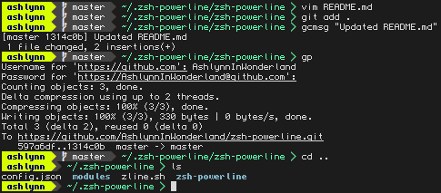

# zsh-powerline
A modular powerline for zsh written in python

*Currently only works in URxvt*

No support for a right prompt yet, but it's coming.



To install:
```
curl https://raw.githubusercontent.com/AshlynnInWonderland/zsh-powerline/master/setup.sh | sh -
```

Requires a [patched powerline font](https://github.com/powerline/fonts)
